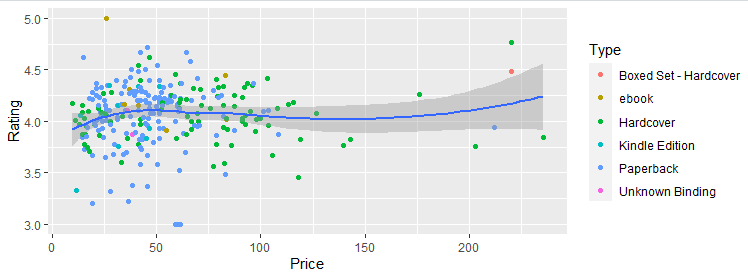
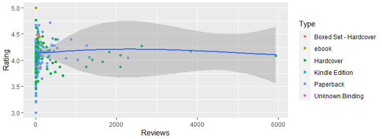

# Individual Assignment

**Created by นายยุทธศาสตร์ ประจักษ์สุวรรณ (ID: 63130500097)**

Choose Dataset:
1. Top 270 Computer Science / Programing Books (Data from Thomas Konstantin, [Kaggle](https://www.kaggle.com/thomaskonstantin/top-270-rated-computer-science-programing-books)) >> [Using CSV](https://raw.githubusercontent.com/safesit23/INT214-Statistics/main/datasets/prog_book.csv)


### Outlines
### Part A
1. Explore the dataset
2. Transform data with dplyr and finding insight the data
3. Visualization with GGplot2
4. Tidyverse example
### Part B
1. Power BI

## Part A
## Part 1: Explore the dataset

```
# Library
library(dplyr)
library(stringr)
library(tidyr)
library(assertive)
library(readr)
library(tidyr)
library(plyr)

# Dataset
cs <- read_csv("https://raw.githubusercontent.com/safesit23/INT214-Statistics/main/datasets/prog_book.csv")
```

In this dataset has Top 270 Computer Science / Programing Books

## Part 2: Transform data with dplyr and finding insight the data


### 1. Rating เฉลี่ยของหนังสือทั้ง 270 เล่ม

```
cs %>% summarise(Mean = mean(Rating))
```

Result: 

```
4.067417
```
- ค่าเฉลี่ยเรตติ้งอยู่ที่ 4.067417 ซึ่งเป็นเกณฑ์ที่น่าพึงพอใจสำหรับผู้อ่านโดยทั่วไป ถือว่าสมเหตุสมผลสำหรับหนังสือ Top 270 เล่ม


### 2. จำนวนหนังสือของแต่ละประเภท

```
count(cs$Type)
```

Result: 

```
1.Boxed Set - Hardcover   1
2.ebook                   7
3.Hardcover               95
4.Kindle Edition          10
5.Paperback               156
6.Unknown Binding         2
```
- จำนวนที่มากที่สุดคือหนังสือประเภท หนังสือปกอ่อน ซึ่งเป็นประเภทหนังสือที่เปิดอ่านง่าย เข้าถึงได้ง่ายสำหรับทุกคน


### 3. เรตติ้งเฉลี่ยของหนังสือแต่ละประเภท

```
cs %>% filter(Type == 'Boxed Set - Hardcover') %>% summarise('Boxed Set - Hardcover' = mean(Rating))
cs %>% filter(Type == 'ebook') %>% summarise(ebook = mean(Rating))
cs %>% filter(Type == 'Hardcover') %>% summarise(Hardcover = mean(Rating))
cs %>% filter(Type == 'Kindle Edition') %>% summarise('Kindle Edition' = mean(Rating))
cs %>% filter(Type == 'Paperback') %>% summarise(Paperback = mean(Rating))
cs %>% filter(Type == 'Unknown Binding') %>% summarise('Unknown Binding' = mean(Rating))
```

Result: 

```
1.Boxed Set - Hardcover   4.49
2.ebook                   4.285714
3.Hardcover               4.059895
4.Kindle Edition          4.015
5.Paperback               4.063846
6.Unknown Binding         3.99
```
- Boxed Set - Hardcover มีค่าเฉลี่ยเรตติ้งที่ดีที่สุดเนื่องจากมีเล่มเดียวและได้เรตติ้งที่อยู่ในระดับสูง และที่รองลงมาคือประเภท ebook ซึ่งโดยรวมเรตติ้งถือว่าอยู่ในเกณฑ์ที่ดี


### 4. ค่าเฉลี่ยของจำนวนหน้าหนังสือทั้งหมด

```
cs %>% summarise(Mean = mean(Number_Of_Pages))
```

Result: 

```
475.0775
```
- โดยรวมหนังสือมีจำนวนหน้าอยู่ที่ประมาณ 475 หน้า ซึ่งเป็นจำนวนที่สมเหตุสมผลสำหรับหนังสือวิชาการด้านโปรแกรม และ วิทยาศาสตร์คอมพิวเตอร์


### 5. จำนวนหน้าเฉลี่ยของหนังสือแต่ละประเภท

```
cs %>% filter(Type == 'Boxed Set - Hardcover') %>% summarise('Boxed Set - Hardcover' = mean(Number_Of_Pages))
cs %>% filter(Type == 'ebook') %>% summarise(ebook = mean(Number_Of_Pages))
cs %>% filter(Type == 'Hardcover') %>% summarise(Hardcover = mean(Number_Of_Pages))
cs %>% filter(Type == 'Kindle Edition') %>% summarise('Kindle Edition' = mean(Number_Of_Pages))
cs %>% filter(Type == 'Paperback') %>% summarise(Paperback = mean(Number_Of_Pages))
cs %>% filter(Type == 'Unknown Binding') %>% summarise('Unknown Binding' = mean(Number_Of_Pages))
```

Result: 

```
1.Boxed Set - Hardcover   896
2.ebook                   386
3.Hardcover               614.4632
4.Kindle Edition          283.4
5.Paperback               406.6795
6.Unknown Binding         249
```
- หนังสือแต่ละประเภทมีค่าเฉลี่ยจำนวนหน้าที่ไม่เท่ากัน แต่จำนวนถือว่าสมเหตุสมผลสำหรับหนังสือด้านวิชาการ


### 6. ราคาเฉลี่ยของหนังสือแต่ละประเภท

```
cs %>% filter(Type == 'Boxed Set - Hardcover') %>% summarise('Boxed Set - Hardcover' = mean(Price))
cs %>% filter(Type == 'ebook') %>% summarise(ebook = mean(Price))
cs %>% filter(Type == 'Hardcover') %>% summarise(Hardcover = mean(Price))
cs %>% filter(Type == 'Kindle Edition') %>% summarise('Kindle Edition' = mean(Price))
cs %>% filter(Type == 'Paperback') %>% summarise(Paperback = mean(Price))
cs %>% filter(Type == 'Unknown Binding') %>% summarise('Unknown Binding' = mean(Price))
```

Result: 

```
1.Boxed Set - Hardcover   220.3853
2.ebook                   51.35
3.Hardcover               70.13449
4.Kindle Edition          32.38559
5.Paperback               45.76893
6.Unknown Binding         37.21176
```
- หนังสือแต่ละประเภทมีราคาที่ไม่ห่างกันมากเกินไป แต่ Boxed Set ราคากระโดดไปเยอะเพราะคิดว่าน่าจะเป็นที่คำว่า Set (หลายเล่ม)


## Part 3: Visualization with GGplot2
### 1.) กราฟแสดงความสัมพันธ์ระหว่างเรตติ้งและราคา ของหนังสือแต่ละประเภท
```
scat_plot <- cs %>% ggplot(aes(x=Price, y=Rating))+
  geom_point(aes(color=Type))

scat_plot+geom_smooth()
```
Result:



### 2.) กราฟแสดงความสัมพันธ์ระหว่างเรตติ้งและจำนวนรีวิว ของหนังสือแต่ละประเภท
```
scat_plot2 <- cs %>% ggplot(aes(x=Reviews, y=Rating))+
  geom_point(aes(color=Type))

scat_plot2+geom_smooth()
```
Result:




## Part 4: Tidyverse Example (stringr)
ใช้สำหรับจัดการตัวหนังสือได้ในรูปแบบต่างๆ ยกตัวอย่างเช่น
### 1.
```
Test <- c("Hello", "My", "Name", "Is", "Oat", "Kub")
str_c(Test, collapse = ", ")
```
Result: 

```
"Hello, My, Name, Is, Oat, Kub" (เป็นการเติมตัวหนังสือเข้าไป)
```

### 2.
```
str_sub(Test, 1, 2)
```

Result: 

```
"He" "My" "Na" "Is" "Oa" "Ku" (เป็นการจำกัดตัวอักษรที่แสดงผล)
```

### 3.
```
str_subset(Test, "[aeiou]")
```

Result: 

```
"Hello" "Name"  "Oat"   "Kub" (เป็นการเลือกว่าข้อความไหนมีตัวที่อยู่ใน subset ที่กำหนด
```


## Part B
### Part 1: Power BI
https://app.powerbi.com/groups/me/reports/6d6d62e1-4130-4722-a294-54caacb1094d/ReportSection

### สรุปสิ่งที่ได้ทำจาก Power BI
- เป็น Tool ที่อำนวยความสะดวกได้ดีมากในเรื่องของการวิคราะห์สถิติทางด้านต่างๆ ไม่ต้องโค้ดดิ้ง แค่เลือกใช้คอลัมน์ที่จะนำมาวิเคราะห์
